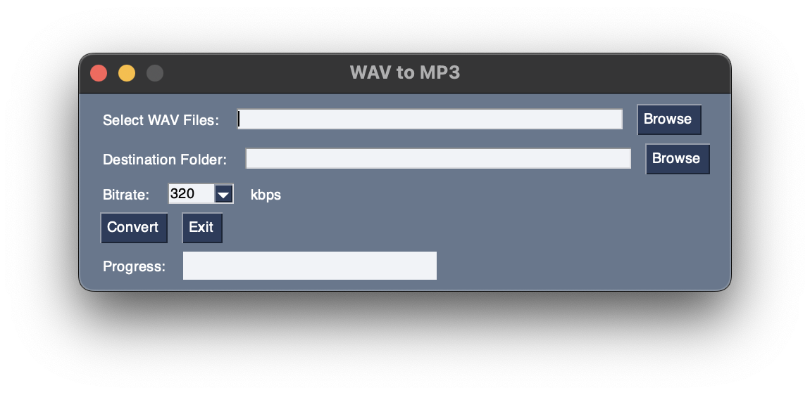

## WAV to MP3 Converter

This Python GUI application converts WAV files to MP3 format.

## Requirements

- Python 3.10
- [PYsimplegui] https://pypi.org/project/PySimpleGUI/
- [ffmpeg](https://ffmpeg.org/)
- make sure both brew install and ffmpeg are in path

## Installation

1. Clone the repository:
   ```bash
   git clone https://github.com/bigandtallrecords/mp3.git
   cd mp3

   pip install PySimpleGUI 
   #or
   brew install PySimpleGUI
   ```

 ## Usage
 - mac - python3 "mp3.py"
 - pc - python "mp3.py"

 
