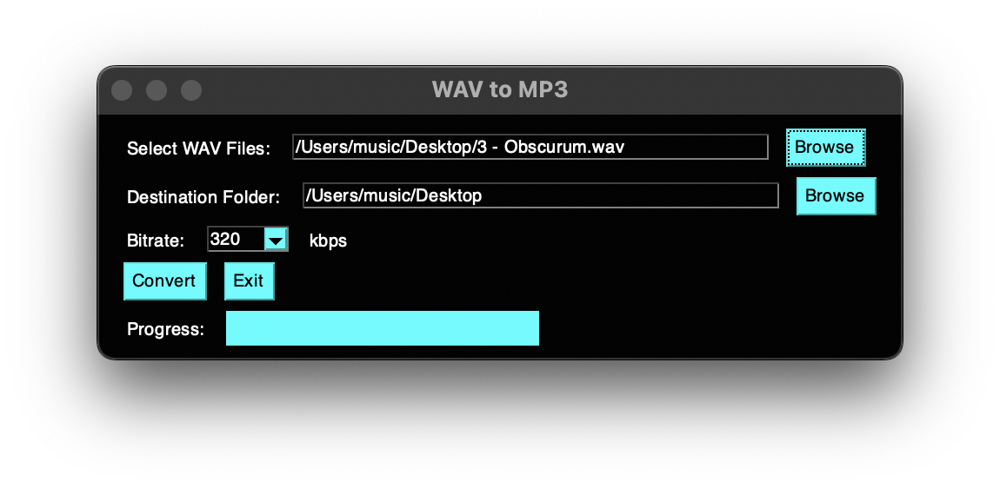

## WAV to MP3 Converter

A free open-source WAV to MP3 converter. Supports batch file selction.
Python GUI application converts WAV files to MP3 format.
For more of my projects keep and eye on my site: 
https://bigandtallrecords.com/code

dontations welcome
 https://www.paypal.com/paypalme/DanielOdom

❤️

## Requirements

- Python 3.10
- [PYsimplegui] https://pypi.org/project/PySimpleGUI/
- [ffmpeg](https://ffmpeg.org/)
- for Mac make sure both brew and ffmpeg are in path

## Installation

1. Clone the repository:
   ```bash
   git clone https://github.com/bigandtallrecords/mp3.git
   cd mp3

   pip install PySimpleGUI 
   #or
   brew install PySimpleGUI
   ```

 ## Usage
 - mac - python3 "mp3.py"
 - pc - python "mp3.py"

 

 If you like my open-source software you may also like my music
 https://bigandtallrecords.com/music

 dontations welcome
 https://www.paypal.com/paypalme/DanielOdom

<span style="color: #ff69b4;">if donations aren't your thing perhaps a cooll mug with klaus schwab's face on it?</span>

 

<span style="color: #00ffff;">or perhaps a cool shirt of a floppy disk?(#00ffff).</span>


<span style="color: #ff69b4;">not gonna lie we are also looking for a handout like everyone else...</span>


love
daniel 
❤️❤️❤️